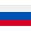

<h2 align="left">
 <abc>
   Hello! こんにちは！ 
    I'm Petre-Marian Vaduva :blush: ペトレ マリアン ヴァドゥヴァ です。 
    Software Developer ソフトウェアデベロッパー  
  
  <h3 align="left">
 <abc>
  I am looking forward to absorb knowledge, gain experience, collaborate and build amazing products for the world! 🌠 
  私は常に新しい能力を身につけ、経験を積み、様々な方々とコラボレーションをしながら世界的に役立つアプリ開発などをしていきたいと思います。
 </abc>
</h3>
   
    
 </abc>
</h2> 

<h2 align="left">:hammer_and_wrench: Technologies and Tools I use:</h2>

    
    
    
    
    
    

<h2 align="left">👨🏻‍💻 About Me</h2>

- 📝 I regularly write articles on: https://www.linkedin.com/in/petre-marian-vaduva-9b4b46201/detail/recent-activity/posts/
- :man_technologist: All of my projects are available at: https://petre-marian-vaduva.github.io/
- 📄 Know about my experience: cv-link
- :dart: Life Hack: Do your hardest task first thing in the morning !!!  
-   

<h2 align="left">:heart: Let's get connected:</h2>

 
 

<!--
**petre-marian-vaduva/petre-marian-vaduva** is a ✨ _special_ ✨ repository because its `README.md` (this file) appears on your GitHub profile.

Here are some ideas to get you started:

- 🔭 I’m currently working on ...
- 🌱 I’m currently learning ...
- 👯 I’m looking to collaborate on ...
- 🤔 I’m looking for help with ...
- 💬 Ask me about ...
- 📫 How to reach me: ...
- 😄 Pronouns: ...
- ⚡ Fun fact: ...
-->

